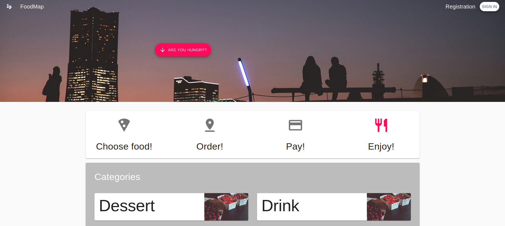

# WS Demo

## This is a demo setup from [WS-APP](https://github.com/kocsmarb/ws-app), [WS-Middleware](https://github.com/kocsmarb/ws-middleware) and a postgres database

## Start the services

> `docker-compose up -d`

## Load dummy products to the database

> docker exec -i `ws-db` psql -U `developer` `developer` < backup.sql

## Open the browser

> Client App http://localhost/

> GraphQL Playground http://localhost:4000

